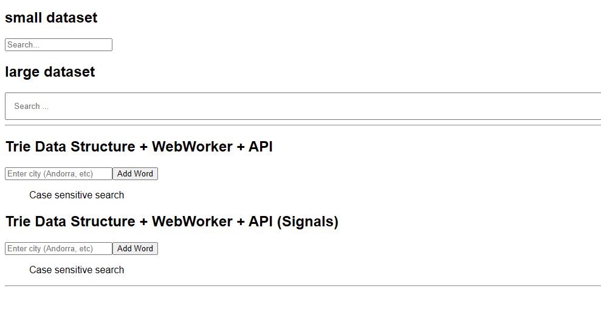

# Angular (21+) Autocomplete using Trie DS and signals

## Demo



## Solution

> Combining a Trie, a Web Worker and Angular signals is a solid, modern way to deliver autocomplete on a large DataSet. Each piece solves a different bottleneck:

- Trie (algorithmic efficiency)
```js
O(prefix length) lookup regardless of how many total words you store.
Stores common prefixes only once, so it scales better than an array of strings + filter.
Natural support for prefix-based limits (first 10 matches, etc.).
```

- Web Worker (main-thread isolation)
```js
Building the trie and traversing it are CPU-bound; doing them off the main thread keeps scroll/tap/animation smooth.
Lets you work with hundreds of thousands of items without blocking change-detection.
```

- Signals (UI reactivity)
```js
The component state (input() and suggestions()) is a pair of synchronous, garbage-free primitives — no RxJS boilerplate, no subscriptions to remember to tear down.
Effects run only when the signal they read changes, minimising view updates.
Fits the "derive everything, store nothing" philosophy: template simply calls suggestions().
```

---

## Solution: small dataset

> Node Server Running in :3000

```js
// run server
cd back-end && node .\server.js 

curl http://localhost:3000/world-cities.txt

http://localhost:3000/world-cities.txt
```

Angular client running :4200

---

### :100: <i>Thanks!</i>
#### Now, don't be an stranger. Let's stay in touch!

<a href="https://github.com/leolanese" target="_blank" rel="noopener noreferrer">
  
</a>

##### :radio_button: linkedin: <a href="https://www.linkedin.com/in/leolanese/" target="_blank">@LeoLanese</a>
##### :radio_button: Twitter: <a href="https://twitter.com/LeoLanese" target="_blank">@LeoLanese</a>
##### :radio_button: DEV.to: <a href="https://www.dev.to/leolanese" target="_blank">Blog</a>
##### :radio_button: Questions / Suggestion / Recommendation: developer@leolanese.com
