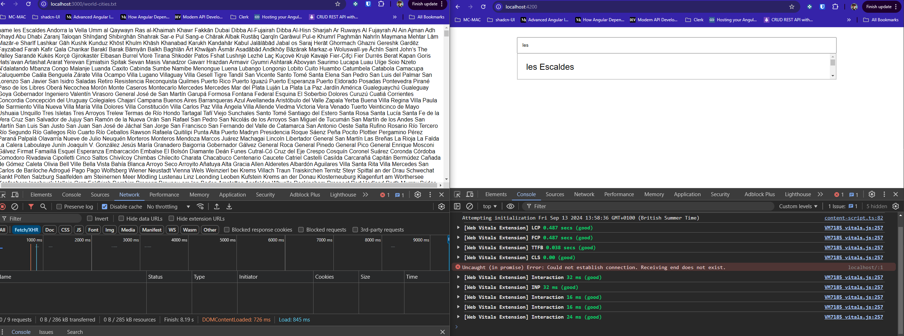
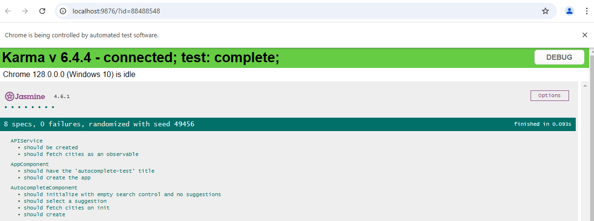

# Angular Autocomplete (using Trie Data Structure)

You should implement an autocomplete component (suitable for a shared component library).

- Do not use any UI libraries such as Bootstrap/Material for the autocomplete logic/UI
- The UI shouldn't be fancy, but a nice-looking UI will be appreciated
- The component should be written using Angular
- Bonus - add meaningful unit tests for your work

To demonstrate it, you should write a minimal webserver in Go or Node.js that serves up the contents of world-cities.txt as required.

Please don't share this exercise or solution on any public profiles. Thanks!

---

# Angular - Autocomplete

## Solution

Node Server Running in :3000

```js
// run server
node .\server.js 

curl http://localhost:3000/world-cities.txt

http://localhost:3000/world-cities.txt
```

Angular client running :4200


## Demo:



## unit-test



---

This project was generated with [Angular CLI](https://github.com/angular/angular-cli) version 18.0.3.

## Development server

Run `ng serve` for a dev server. Navigate to `http://localhost:4200/`. The application will automatically reload if you change any of the source files.

## Code scaffolding

Run `ng generate component component-name` to generate a new component. You can also use `ng generate directive|pipe|service|class|guard|interface|enum|module`.

## Build

Run `ng build` to build the project. The build artifacts will be stored in the `dist/` directory.

## Running unit tests

Run `ng test` to execute the unit tests via [Karma](https://karma-runner.github.io).

## Running end-to-end tests

Run `ng e2e` to execute the end-to-end tests via a platform of your choice. To use this command, you need to first add a package that implements end-to-end testing capabilities.

## Further help

To get more help on the Angular CLI use `ng help` or go check out the [Angular CLI Overview and Command Reference](https://angular.dev/tools/cli) page.

